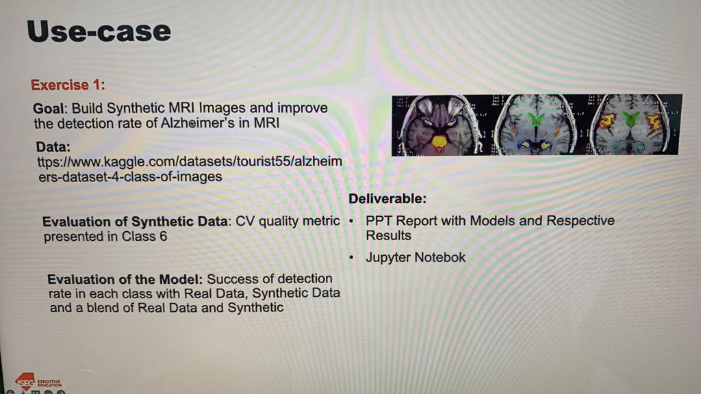
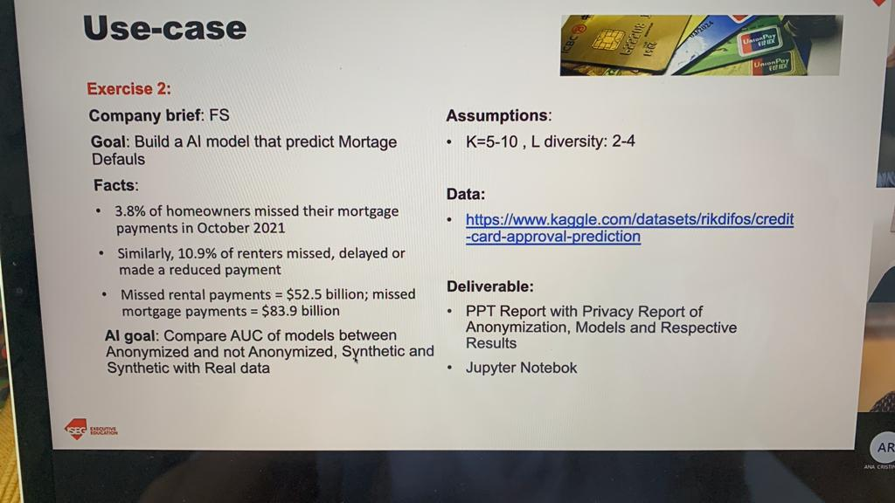

# iseg_07_ppai_group

## tasks ex1 - MRI
- modelo "normal"
- synth data
- modelo synth data
- modelo syn data + dados
- data
  - https://www.kaggle.com/datasets/tourist55/alzheimers-dataset-4-class-of-images

## tasks ex2 - credit card approval
- modelo de não anonamizados
- anonamizar
- modelo de anonamizados
- synth data de anonamizados
- modelo synth data
- modelo syn data + dados anonamizados
- data:
  - https://www.kaggle.com/datasets/rikdifos/credit-card-approval-prediction

